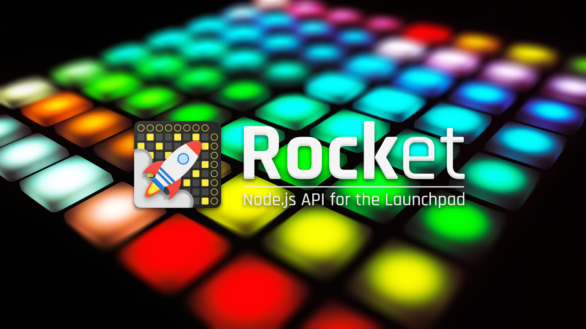

<div align="center">



[](https://www.npmjs.com/package/launchpad-rocket)
[](https://travis-ci.org/evelynhathaway/launchpad-rocket)
[](https://github.com/evelynhathaway/launchpad-rocket/network/dependencies)
[]()
[](doc)
</div>


## Installation
See [Documentation > Installation](doc/Installation.md) for more information.
###### From npm
```bash
$ npm install launchpad-rocket
```
###### As a dependency
```bash
# Create package.json for your own module if you haven't already
$ npm init

# Install Rocket and add to dependencies
$ npm install launchpad-rocket --save
```
###### From source
```bash
$ git clone https://github.com/evelynhathaway/launchpad-rocket
$ cd launchpad-rocket/
$ npm install
```


---


## Getting Started
1. Plug in your Launchpad
2. Make sure your computer installed the drivers or [install them manually](https://us.novationmusic.com/support/product-downloads?product=Launchpad)
3. [Install Rocket](doc/Installation.md)
4. Create a new `.js` file
5. `require()` the package
6. Browse the [documentation](doc)

### Example
```js
// Require Rocket
const rocket = require("launchpad-rocket");

// Make a new device instance
// This method will automatically pick a supported device and its class
const launchpad = new rocket();

// Get a button instance on the Launchpad at bottom-left button
// There are many other ways to get buttons like column, row, quadrant, etc.
const button = launchpad.getByGridCoords(0, 0);

// Set its color to pink
// Rocket supports standard RGB, full RGB, and bi-color values or their names
button.light("pink");

// Log to console on press of the bottom-left button
// Rocket passes helpful values into your function, but let's not use them now
button.on("press", function() {
	console.log("3... 2... 1... Blast off!");
});

// Reset the device and close connection on release of the button named "mixer"
launchpad.getFirstByName("mixer").on("release", function() {
	console.log("Launch aborted!");

	// You can use `this.device` instead of `launchpad` inside of this, but let's use our own reference
	// Reset the Launchpad to defaults (lights, layout, etc)
	launchpad.reset();
	// Close MIDI ports and cleanup
	launchpad.close();
});
```


## Supported Devices
- Launchpad MK2

Currently only the Launchpad MK2 is supported, but and support for the Launchpad Mini and Launchpad Pro are planned. Hopefully the module is also structured in such a way that other Novation devices could be added in the future with a minimal amount of breaking changes. If you're interested in expanding the support to your device, contact me or check out a related issue.


## Other APIs
While this API is maturing, I wouldn't be hurt if you took a look at some other open source APIs on GitHub. Many are also a work-in-progress, some are abandoned, an no other repository made their scope so wide in terms of high level interface and large feature set.
| Repository                                                                            | Language   | Supports  |
|---------------------------------------------------------------------------------------|------------|-----------|
| [tjhorner/node-launchpad-mk2](https://github.com/tjhorner/node-launchpad-mk2)         | JavaScript | Pro, MK2? |
| [jasonspriggs/LP4J](https://github.com/jasonspriggs/LP4J)                             | Java       | MK2       |
| [OlivierCroisier/LP4J](https://github.com/OlivierCroisier/LP4J)                       | Java       | Mini, S?  |
| [Granjow/launchpad-mini](https://github.com/Granjow/launchpad-mini)                   | JavaScript | Mini, S?  |
| [stevenleeg/launchpadder](https://github.com/stevenleeg/launchpadder)                 | JavaScript | Mini, S?  |
| [sydlawrence/node-midi-launchpad](https://github.com/sydlawrence/node-midi-launchpad) | JavaScript | Mini, S?  |
| [millerpeterson/js-launchpad](https://github.com/millerpeterson/js-launchpad)         | JavaScript | Mini, S?  |

## Contributing
If you find any bugs or would like to suggest features, [make an issue](Issue template TODO) for it being as descriptive as possible and I'll do my best to address it.

If you have a Launchpad that's not supported, have ideas for new features, or just want to fix it up a bit; pull requests are highly appreciated.


## License
Copyright Evelyn Hathaway, [MIT License](https://github.com/evelynhathaway/launchpad-rocket/blob/master/LICENSE)
