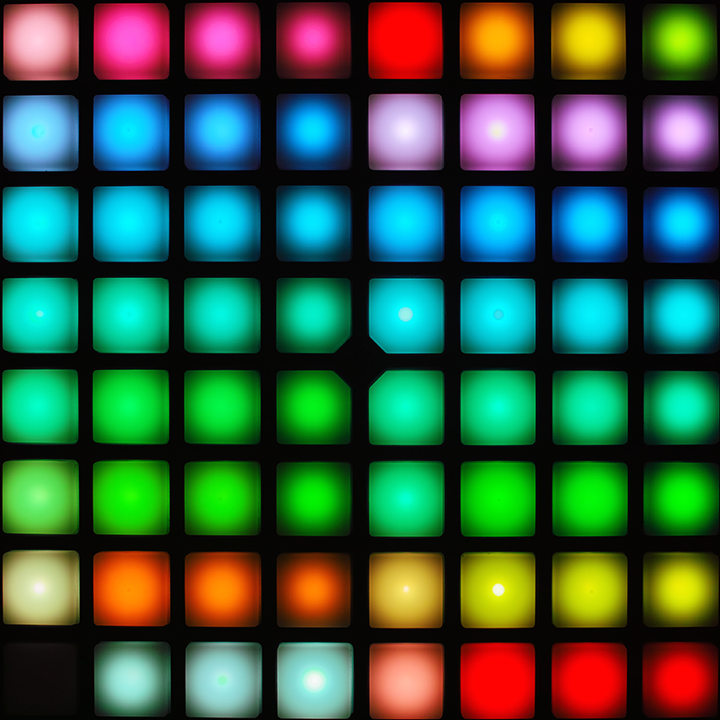
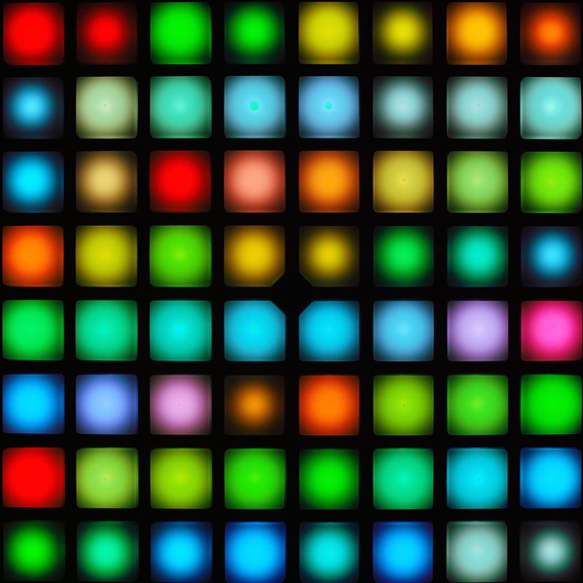

# Table of Contents
<!-- TOC depthFrom:1 depthTo:3 withLinks:1 updateOnSave:1 orderedList:0 -->

- [Table of Contents](#table-of-contents)
- [Standard RGB](#standard-rgb)
	- [From Novation's Programmer's Reference](#from-novations-programmers-reference)
	- [From Photographs](#from-photographs)
- [Full RGB](#full-rgb)
- [Bi-color](#bi-color)
- [Named Colors](#named-colors)
	- [Default](#default)
		- [RGB](#rgb)
		- [Bi-color](#bi-color)
	- [Custom](#custom)

<!-- /TOC -->


---


# Standard RGB
The RGB Launchpads (currently only the Pro and MK2, sorry Mini) support 128 standard colors to be used when lighting a button or any other command that requires a color.
#### Example
```js
// Set the button to this nice decimal color
button.light(8);

// Turn off that pesky gross sepia color (you can also use "black" and "off")
button.light(0);
```

## From Novation's Programmer's Reference
This doesn't tell the full story and they look super gross! Novation exaggerated the colors to distinguish the dimmer colors from the brighter.


## From Photographs
I did start from the bottom-left rather than from top-left since that was easier in early stages of development. I tried to use mainly page one for the default colors since the second page is mainly granulation of the those. These photographs are color corrected from a RAW image.

Here are the colors 0 - 63 (inclusive) which are on the first part of the image from Novation.



Colors 64 - 127 (inclusive), again starting from the bottom-left rather than from top-left.




# Full RGB
The Launchpads that support the 128 colors mentioned above also support RGB colors. Sadly the range of each brightness value is 0 - 63 (inclusive). You can only use these colors when setting a button's color and not the whole device, column, row, text scrolling, flashing, etc. Rocket tries to help offload the duty of creating a workaround by polyfilling in support for a few of these missing features by calling other methods multiple times.
#### Example
```js
// Object of numbers
button.light({
	"red": 10,
	"green": 20,
	"blue": 30
});
```
```js
// Object of numbers, abbreviated
button.light({
	"r": 10,
	"g": 20,
	"b": 30
});
```
```js
// Array of numbers
button.light([10, 20, 30]);
```


---


# Bi-color
The Launchpads that don't support RGB colors (Mini, S) support the changing of brightness for two LEDs — red and green — per button. The range of each brightness value is 0 - 3 (inclusive).
#### Example
```js
// Array of numbers
button.light([3, 0]);
```


---


# Named Colors

## Default
Using those images, counting, using a table, and doing mental math is pretty tedious; so I added some default names that you can use in place of standard, RGB, or bi-color values. You should notice that black is actually off and there are a few aliases.

### RGB
| Name (string) | Value (number, RGB, alias) |
|---------------|----------------------------|
| dark red      | 7                          |
| red           | 5                          |
| pink          | 95                         |
| fuchsia       | 58                         |
| purple        | 55                         |
| dark purple   | 81                         |
| indigo        | 50                         |
| blue          | 45                         |
| light blue    | 41                         |
| cyan          | 37                         |
| teal          | 65                         |
| green         | 23                         |
| light green   | 21                         |
| lime          | 17                         |
| yellow        | 62                         |
| amber         | 61                         |
| orange        | 9                          |
| dark orange   | 11                         |
| brown         | 83                         |
| sepia         | 105                        |
| gray          | 71                         |
| grey          | gray                       |
| blue gray     | 103                        |
| blue grey     | blue gray                  |
| white         | 3                          |
| black         | 0                          |
| off           | black                      |

### Bi-color
| Name (string) | Value ([red, green], alias) |
|---------------|-----------------------------|
| red           | bright red                  |
| dark red      | [1, 0]                      |
| medium red    | [2, 0]                      |
| bright red    | [3, 0]                      |
| amber         | bright amber                |
| dark amber    | [1, 1]                      |
| medium amber  | [2, 2]                      |
| bright amber  | [3, 3]                      |
| yellow        | bright yellow               |
| medium yellow | [1, 2]                      |
| bright yellow | [2, 3]                      |
| green         | bright green                |
| dark green    | [0, 1]                      |
| medium green  | [0, 2]                      |
| bright green  | [0, 3]                      |
| black         | off                         |
| off           | [0, 0]                      |

## Custom
You can add or replace the color names for a specific device class by modifying `launchpad.constructor.color.names`, an object with names and values as key-value pairs.
#### Example
```js
// Replace the default color names with yours for all devices of the same class
launchpad.constructor.color.names = {
	"fabulous": 57,
	"alias": "fabulous",
	"a cool rgb color": {
		"red": 10,
		"green": 20,
		"blue": 30
	}
};

// Add color "flashy"
launchpad.constructor.color.names.flashy = 1;

// Use them as you'd use a default color name
launchpad.light("fabulous");
button.flash("flashy");
```
