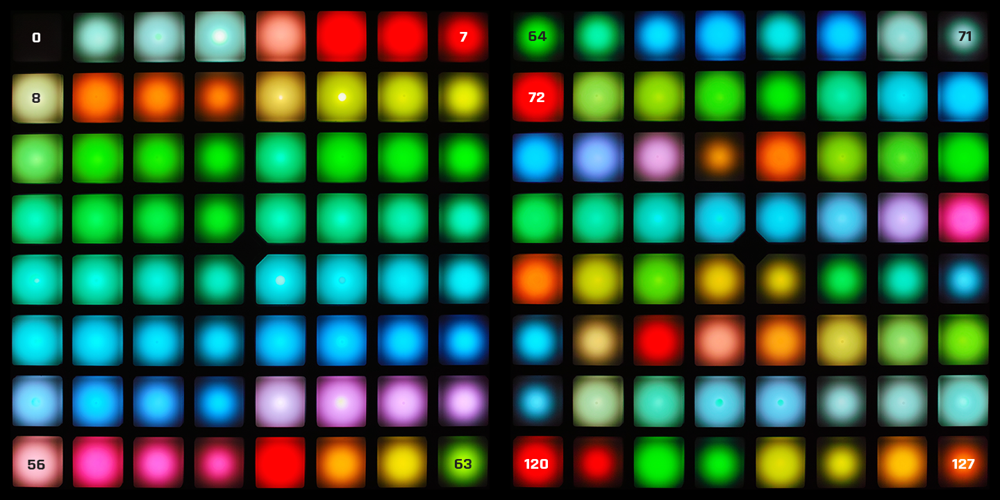

# Color
The older devices — Launchpad S, Launchpad Mini — only support bi-color while the newer devices — Launchpad MK2, Launchpad Pro — support RGB colors and not bi-color. Here I outline the differences and explain what that means for interacting with your device. Examples for using these colors can be found in [Interaction](interaction.md).

<!-- TOC depthFrom:1 depthTo:4 withLinks:1 updateOnSave:1 orderedList:0 -->

- [Color](#color)
	- [Bi-color](#bi-color)
	- [RGB](#rgb)
		- [Standard RGB](#standard-rgb)
		- [Full RGB](#full-rgb)
	- [Named Colors](#named-colors)
		- [Default](#default)
			- [Named RGB](#named-rgb)
			- [Named Bi-color](#named-bi-color)
		- [Custom Names](#custom-names)

<!-- /TOC -->


---


## Bi-color
The Launchpads that don't support RGB colors — Launchpad Mini, Launchpad S — support the changing of brightness for two LEDs — red and green — per button. The range of each brightness value is 0 - 3 (inclusive). Combining these brightnesses you can create colors of the hues of amber and yellow. All possible colors are [named](#named-bi-color) for ease of use.


---


## RGB
The Launchpads that support RGB colors — Launchpad MK2, Launchpad Pro — support the changing of brightness for three LEDs — red, green, and blue — per button. The RGB color support is divided between "standard" colors and "full" RGB colors. I make this distinction because full RGB colors can't be used in many places that expect a standard color as a limitation of the available MIDI commands. These colors have [default names](#named-rgb) and can be [named by the user](#custom-names).

### Standard RGB
The 128 standard colors are a single digit can be used anywhere that requires a color. Using these over a full RGB color is typically faster because some methods use a single MIDI command with a static value instead of possibly more expensive operations.

Here are the colors 0 - 63 then 64 - 127 (inclusive). This image should match the terrible graphic from Novation's programmer's reference but the actual colors corrected from a RAW image and not their murky and exaggerated ones.




### Full RGB
If you need more options and using a method that supports full RGB, you have full control over the separate red, green, and blue channels. Sadly the range of each brightness value is 0 - 63 (inclusive). You can't use RGB for most methods and you're only guaranteed support with lighting and using them may be slightly slower than using a standard color.

---


## Named Colors

### Default
Using those images, counting, using a table, and doing mental math is pretty tedious; so I added some default names that you can use in place of standard, RGB, or bi-color values. You should notice that black is actually off and there are a few other aliases.

#### Named RGB
| Name (string) | Value (number, RGB, alias) |
|---------------|----------------------------|
| dark red      | 7                          |
| red           | 5                          |
| pink          | 95                         |
| fuchsia       | 58                         |
| purple        | 55                         |
| dark purple   | 81                         |
| indigo        | 50                         |
| blue          | 45                         |
| light blue    | 41                         |
| cyan          | 37                         |
| teal          | 65                         |
| green         | 23                         |
| light green   | 21                         |
| lime          | 17                         |
| yellow        | 62                         |
| amber         | 61                         |
| orange        | 9                          |
| dark orange   | 11                         |
| brown         | 83                         |
| sepia         | 105                        |
| gray          | 71                         |
| grey          | gray                       |
| blue gray     | 103                        |
| blue grey     | blue gray                  |
| white         | 3                          |
| black         | 0                          |
| off           | black                      |

#### Named Bi-color
| Name (string) | Value ([red, green], alias) |
|---------------|-----------------------------|
| red           | bright red                  |
| dark red      | [1, 0]                      |
| medium red    | [2, 0]                      |
| bright red    | [3, 0]                      |
| amber         | bright amber                |
| dark amber    | [1, 1]                      |
| medium amber  | [2, 2]                      |
| bright amber  | [3, 3]                      |
| yellow        | bright yellow               |
| medium yellow | [1, 2]                      |
| bright yellow | [2, 3]                      |
| green         | bright green                |
| dark green    | [0, 1]                      |
| medium green  | [0, 2]                      |
| bright green  | [0, 3]                      |
| black         | off                         |
| off           | [0, 0]                      |

### Custom Names
You can add or replace the color names for a specific device class by modifying `launchpad.constructor.color.names`, an object with names and values as key-value pairs.
##### Example
```js
// Replace the default color names with yours for all devices of the same class
launchpad.constructor.color.names = {
	"fabulous": 57,
	"alias": "fabulous",
	"a cool rgb color": {
		"red": 10,
		"green": 20,
		"blue": 30
	}
};

// Add color "flashy"
launchpad.constructor.color.names.flashy = 1;

// Use them as you'd use a default color name
launchpad.light("fabulous");
button.flash("flashy");
```
